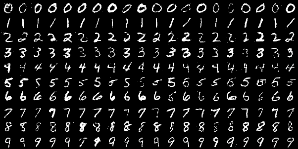

## Conditional Generative Adversarial Networks for Generating Handwriting Numbers

#### 1. Introduction
- In the previous [GAN_MINIST](../GAN_MNIST) we can generate handwriting numbers randomly, for this project we wanna generate numbers conditionally(for example we wanna generate 7, then generated pictures should contain number 7). We will train a CGAN to do this
- The dataset is MNIST, it will be downloaded under the folder `dataset` using torchvision, the dataset folder structure looks like this:
```text
dataset
├── mnist
│   └── MNIST
│   │   └── raw
│   │       ├── t10k-images-idx3-ubyte
│   │       ├── t10k-images-idx3-ubyte.gz
│   │       ├── t10k-labels-idx1-ubyte
│   │       ├── t10k-labels-idx1-ubyte.gz
│   │       ├── train-images-idx3-ubyte
│   │       ├── train-images-idx3-ubyte.gz
│   │       ├── train-labels-idx1-ubyte
│   │       └── train-labels-idx1-ubyte.gz
```

#### 2. Load dataset, Build model, Train model
- We don't have to modify too much, only part of the model and input should be modified, see the code to check this
- Here I use a NVIDIA GeForce RTX 3090 to train, each epoch will cost about 7 seconds
- If you want to train from scratch, you don't have to modify anything. If you finish training and want to generate number picture, modify `mode`, simply run program and wait for your generated numbers
```shell
python run.py
```
- Of course, you can modify the model architecture or try some other hyper-parameters, do anything you want

#### 3. Check the quality of generated image
- I train it for 200 epochs, we will use random Gaussian Noise and label information(for line i, we put label i, i from 0 to 9) to sample some images, here are 200 examples



- I think the quality is just ok, it does generate image according to our label but not that great

#### 4. Some references
- [Generative Adversarial Nets](https://arxiv.org/pdf/1406.2661.pdf)
- [Conditional Generative Adversarial Nets](https://arxiv.org/pdf/1411.1784.pdf)