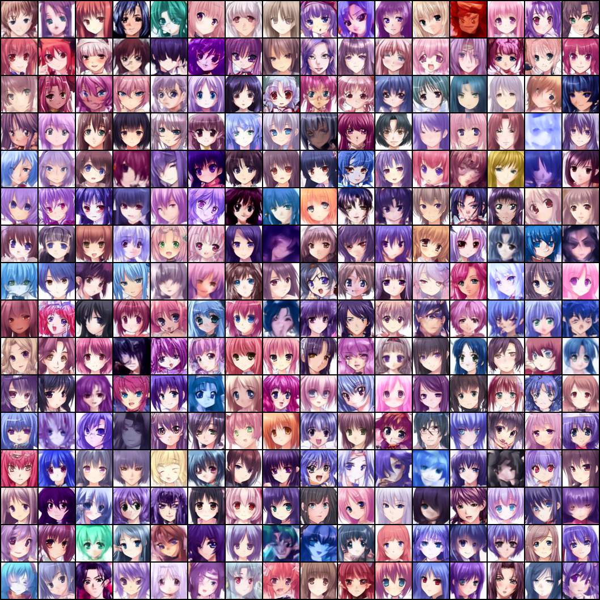
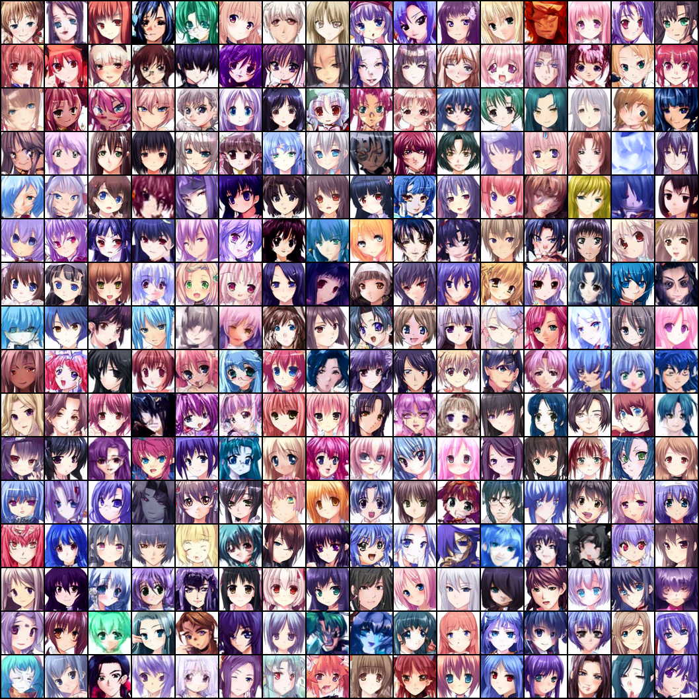
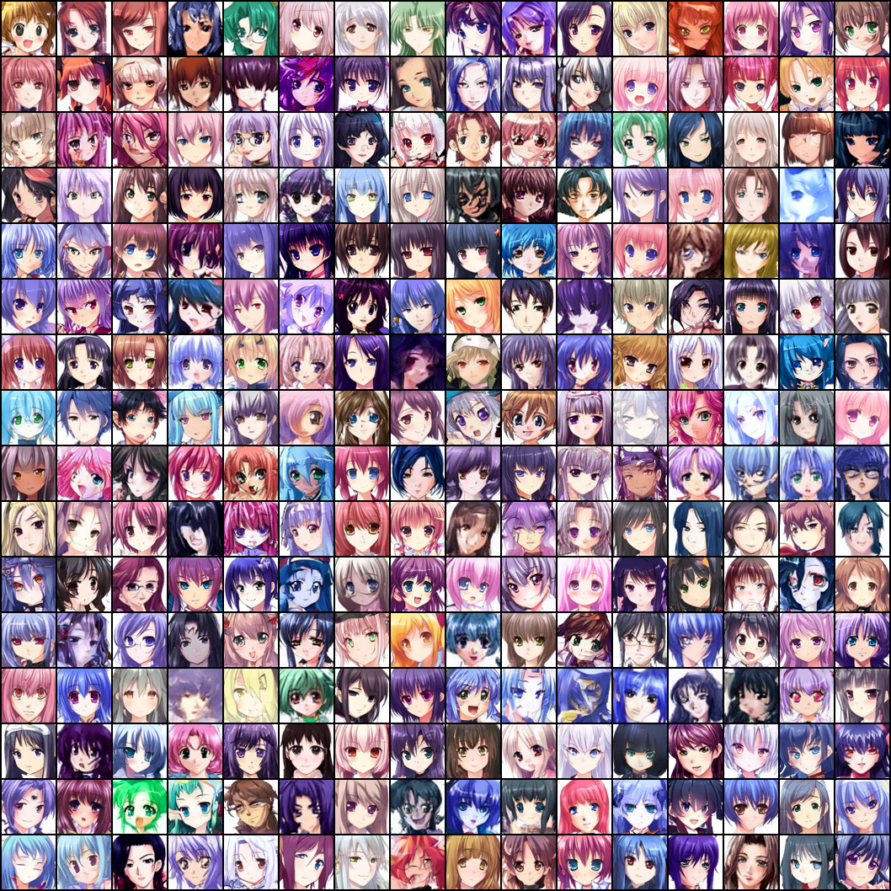
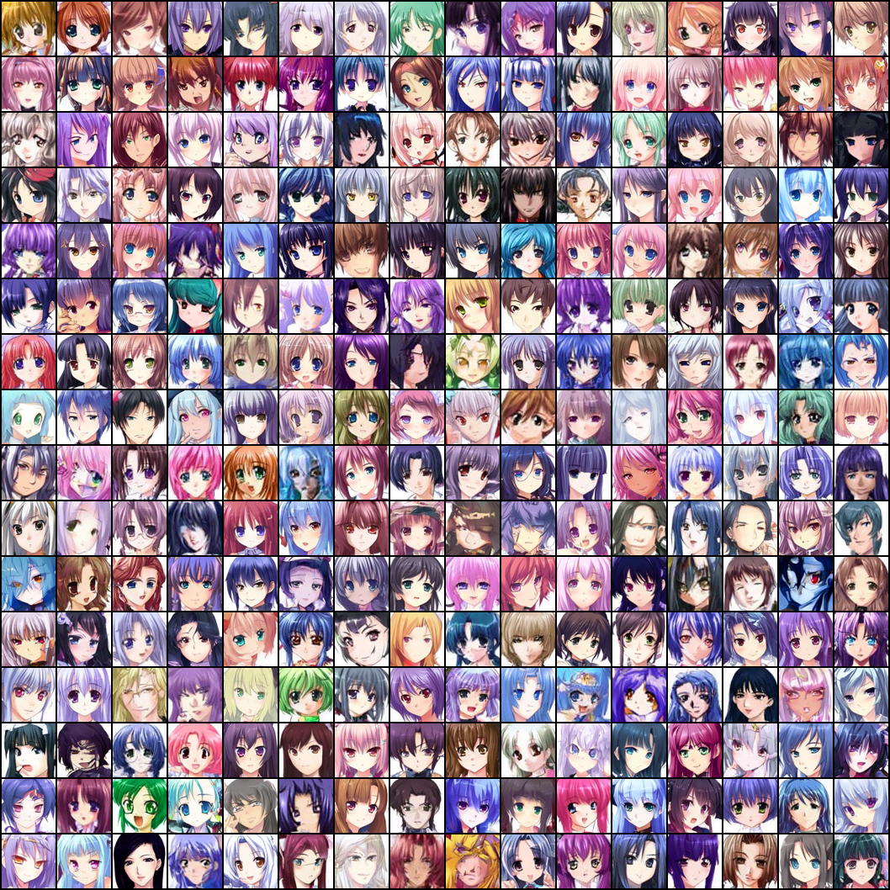
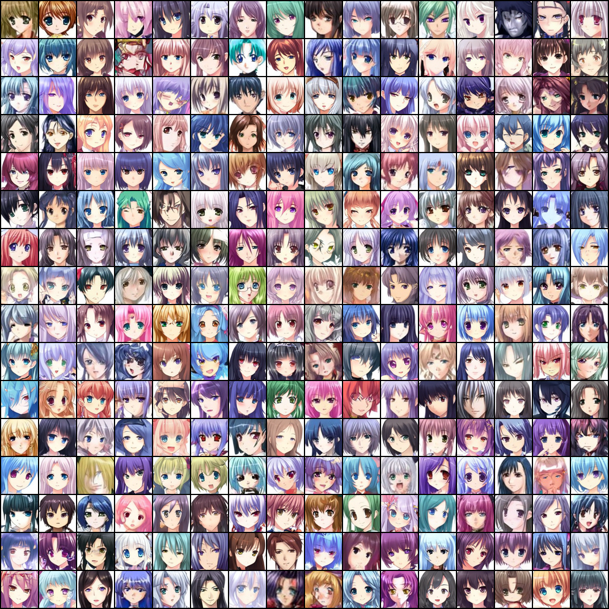
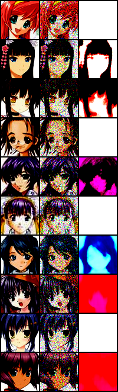

## Denoising Diffusion Implicit Model for Generating Anime face

#### 1. Introduction
- Here we will train a diffusion model to generate anime face 
- The dataset can be downloaded from [kaggle anime face dataset](https://www.kaggle.com/datasets/splcher/animefacedataset), download the dataset to `dataset` directory and put all the images under directory `anime/raw/images`, when you finish, the dataset looks like this:
```text
dataset
├── anime
│   └── raw
│   │   └── images
│   │       ├── 46651_2014.jpg
│   │       ├── 4665_2003.jpg
│   │       ├── ...
```
- Then we have to process these raw images, we've already done it, you can check this step following [VAE_ANIME](../VAE_ANIME), then your directory looks like this:
```text
dataset
├── anime
│   ├── processed
│   │   └── images
│   │       ├── 46651_2014.jpg
│   │       ├── 4665_2003.jpg
│   │       ├── ...
│   └── raw
│   │   └── images
│   │       ├── 46651_2014.jpg
│   │       ├── 4665_2003.jpg
│   │       ├── ...
```

#### 2. Load dataset, Build model, Train model
- For this task the code is nearly the same to [DDPM_ANIME](../DDPM_ANIME), we just modify the `model.py` and `run.py` to support DDIM generation
- You don't have to train it again, just use the checkpoints in your [DDPM_ANIME](../DDPM_ANIME)
- Here I would like to run the program by shell, this will make sure that every time we run the program, random noise is the same
```shell
sh sample.sh
```

#### 3. Check the quality of generated image
- First, let's see the quality of generated image after 10, 100, 1000 steps sampling respectively

<center>DDIM sample_steps=10</center>



<center>DDIM sample_steps=100</center>



<center>DDIM sample_steps=1000</center>


- When we set $eta$ to other value, the results are as follows:

<center>sample_steps=100, eta=0.2</center>



<center>sample_steps=100, eta=0.5</center>



<center>DDPM sample_steps=100, eta=1.0</center>



- I also do another experiment, I add noise to the original image(forward process), then use the noisy image to generate image to see whether it can recover the original image. For the forward process and backward process I set t equals to 100, below are the results(first column is original image, second column is noisy image which we add t steps' noise to original image, third column is generated image using DDIM)

<center>DDIM forward process t=100, reverse process t=100</center>



- We can see generated image's quality are good using DDIM even for 10 steps, this is much faster than DDPM. And DDIM's generative processes is deterministic so the image's high-level feature remains the same which DDPMs are not. But for recover image, DDIM is not able to deal with that but I think the effect is better than DDPM

#### 4. Some references
- [Deep Unsupervised Learning using Nonequilibrium Thermodynamics](https://arxiv.org/pdf/1503.03585.pdf)
- [Denoising Diffusion Probabilistic Models](https://arxiv.org/pdf/2006.11239.pdf)
- [Diffusion Models Tutorial(English Blog)](https://lilianweng.github.io/posts/2021-07-11-diffusion-models/#forward-diffusion-process)
- [Diffusion Models Tutorial(Chinese Blog)](https://zhuanlan.zhihu.com/p/525106459)
- [Diffusion Models Tutorail(Chinese Video)](https://www.bilibili.com/video/BV1b541197HX)
- [Diffusion Models implementation from scratch in PyTorch(English Videl)](https://www.youtube.com/watch?v=a4Yfz2FxXiY)
- [Unofficial PyTorch implementation of Denoising Diffusion Probabilistic Models](https://github.com/w86763777/pytorch-ddpm)
- [OpenAI implementation of Improved Diffusion](https://github.com/openai/improved-diffusion/tree/main)