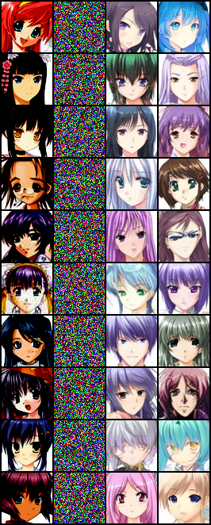

## Denoising Diffusion Probabilistic Model for Generating Anime face

#### 1. Introduction
- Here we will train a diffusion model to generate anime face 
- The dataset can be downloaded from [kaggle anime face dataset](https://www.kaggle.com/datasets/splcher/animefacedataset), download the dataset to `dataset` directory and put all the images under directory `anime/raw/images`, when you finish, the dataset looks like this:
```text
dataset
├── anime
│   └── raw
│   │   └── images
│   │       ├── 46651_2014.jpg
│   │       ├── 4665_2003.jpg
│   │       ├── ...
```
- Then we have to process these raw images, we've already done it, you can check this step following [VAE_ANIME](../VAE_ANIME), then your directory looks like this:
```text
dataset
├── anime
│   ├── processed
│   │   └── images
│   │       ├── 46651_2014.jpg
│   │       ├── 4665_2003.jpg
│   │       ├── ...
│   └── raw
│   │   └── images
│   │       ├── 46651_2014.jpg
│   │       ├── 4665_2003.jpg
│   │       ├── ...
```

#### 2. Load dataset, Build model, Train model
- For this task we follow the original paper's model, but it's slightly different, if you want to use the cifar10 model in paper, change the following parameters
```shell
ch = 128
ch_mult = [1, 1, 2, 2]
attn = [1]  # only in 16 * 16 resolution we use attention
```
This model takes up a lot of video memory
- Note that this model cost lots of cuda memory(~20GB), if you use the cifar10 model setting, it will cost about 24GB cuda memory, make sure you have enough memory or you have to reduce batch size
- Here I just use a NVIDIA GeForce RTX 3090 to train, each epoch will cost about 3min30s
- If you want to train from scratch, you have to modify `mode` to `train`. If you finish training and want to generate anime picture, modify `mode` to `test`, simply run program and wait for your generated anime faces
```shell
python run.py
```
- Of course, you can modify the model architecture or try some other hyper-parameters, do anything you want

#### 3. Check the quality of generated image
- I train for 500 epochs, but I find the effect is pretty good even only train for 100 epochs(but it's less stable), so if you want to save time you can stop training after 100 epochs iteration
- Because of the long training and some people will have insufficient resources, I have release the checkpoint so you don't have to train from scratch, and you can also check the log
- Then we will use random Gaussian Noise to sample images. In the DDPM paper, there are two posterior variance, so here we also test these two settings

- First, we set $\sigma_{t}^2 = \beta_{t}$, below are 256 examples and six diffusion process using this posterior variance setting


- Second, we set $\sigma_{t}^2 = \frac{1-\bar{\alpha}_{t-1}}{1-\bar{\alpha}_{t}}\beta_{t}$, below are 256 examples and six diffusion process using this posterior variance setting


- I think the quality is pretty good compare to [VAE](../VAE_ANIME) and [GAN](../GAN_ANIME). This is not a fair comparison cause this diffusion model has 25.4M parameters which is larger, but this result is delighted.
- Here I also do another experiment, I add noise to the original image(forward process), then use the noisy image to generate image to see whether it can recover the original image. For the forward process I set t equals to 100, 500, 1000 respectively, then denoise steps equals to 1000, below are the results(first column is original image, second column is noisy image which we add t steps' noise to original image, third column is generated image using first posterior variance, fourth column is generated image using second posterior variance)

<center>forward process t=100, reverse process t=1000</center>


<center>forward process t=500, reverse process t=1000</center>


<center>forward process t=1000, reverse process t=1000</center>



- We can see that the generated image is totally different to original image, even we just add 100 steps' noise. And here we can see that when forward process t is small, the generated image is blank(I don't know why, and I guess this observation can be a latent research direction)

#### 4. Some references
- [Deep Unsupervised Learning using Nonequilibrium Thermodynamics](https://arxiv.org/pdf/1503.03585.pdf)
- [Denoising Diffusion Probabilistic Models](https://arxiv.org/pdf/2006.11239.pdf)
- [Diffusion Models Tutorial(English Blog)](https://lilianweng.github.io/posts/2021-07-11-diffusion-models/#forward-diffusion-process)
- [Diffusion Models Tutorial(Chinese Blog)](https://zhuanlan.zhihu.com/p/525106459)
- [Diffusion Models Tutorail(Chinese Video)](https://www.bilibili.com/video/BV1b541197HX)
- [Diffusion Models implementation from scratch in PyTorch(English Videl)](https://www.youtube.com/watch?v=a4Yfz2FxXiY)
- [Unofficial PyTorch implementation of Denoising Diffusion Probabilistic Models](https://github.com/w86763777/pytorch-ddpm)