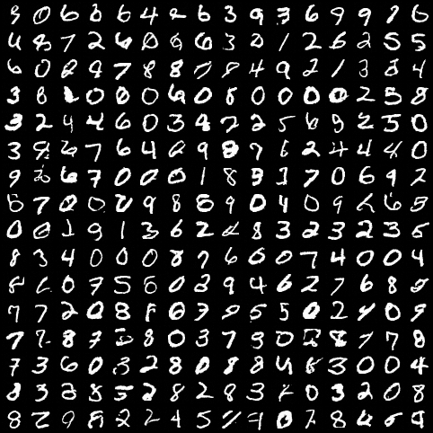
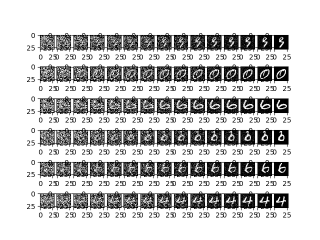

## Denoising Diffusion Probabilistic Model for Generating Handwriting Numbers

#### 1. Introduction
- Here we will train a simple diffusion model to generate handwriting number 
- The dataset is MNIST, it will be downloaded under the folder `dataset` using torchvision, the dataset folder structure looks like this:
```text
dataset
├── mnist
│   └── MNIST
│   │   └── raw
│   │       ├── t10k-images-idx3-ubyte
│   │       ├── t10k-images-idx3-ubyte.gz
│   │       ├── t10k-labels-idx1-ubyte
│   │       ├── t10k-labels-idx1-ubyte.gz
│   │       ├── train-images-idx3-ubyte
│   │       ├── train-images-idx3-ubyte.gz
│   │       ├── train-labels-idx1-ubyte
│   │       └── train-labels-idx1-ubyte.gz
```

#### 2. Load dataset, Build model, Train model
- Actually I try to use a simplest model which is `MLP` to do this task, but I find that doesn't work
- For this task, we build a simple U-Net which contains convolution and residual connection
- Here I use a NVIDIA GeForce RTX 3090 to train, each epoch will cost about 15 seconds
- If you want to train from scratch, you don't have to modify anything. If you finish training and want to generate number picture, modify `mode`, simply run program and wait for your generated numbers

```shell
python run.py
```
- Of course, you can modify the model architecture or try some other hyper-parameters, do anything you want
- In fact this dataset is very easy, so you'll find the result is pretty good after only 100 epochs' training

#### 3. Check the quality of generated image
- First of all, we will use random Gaussian Noise to sample some images, here are 256 examples



- Then let's check the diffusion process, here we show first six diffusion process


- I think the quality is pretty good and note that our model's parameters are only 2.3M(of course this model is more complex than a simple MLP)

#### 4. Some references
- [Deep Unsupervised Learning using Nonequilibrium Thermodynamics](https://arxiv.org/pdf/1503.03585.pdf)
- [Denoising Diffusion Probabilistic Models](https://arxiv.org/pdf/2006.11239.pdf)
- [Diffusion Models Tutorial(English Blog)](https://lilianweng.github.io/posts/2021-07-11-diffusion-models/#forward-diffusion-process)
- [Diffusion Models Tutorial(Chinese Blog)](https://zhuanlan.zhihu.com/p/525106459)
- [Diffusion Models Tutorail(Chinese Video)](https://www.bilibili.com/video/BV1b541197HX)
- [Diffusion Models implementation from scratch in PyTorch(English Videl)](https://www.youtube.com/watch?v=a4Yfz2FxXiY)