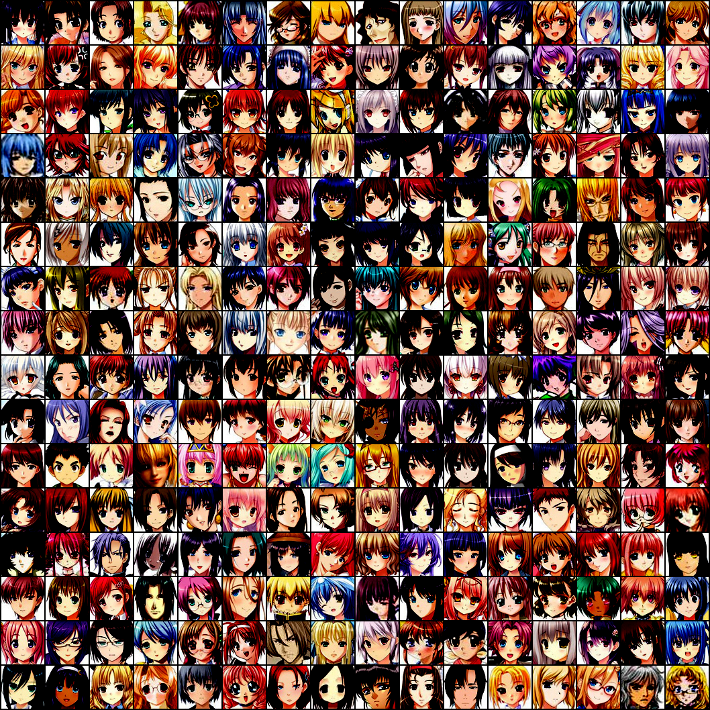
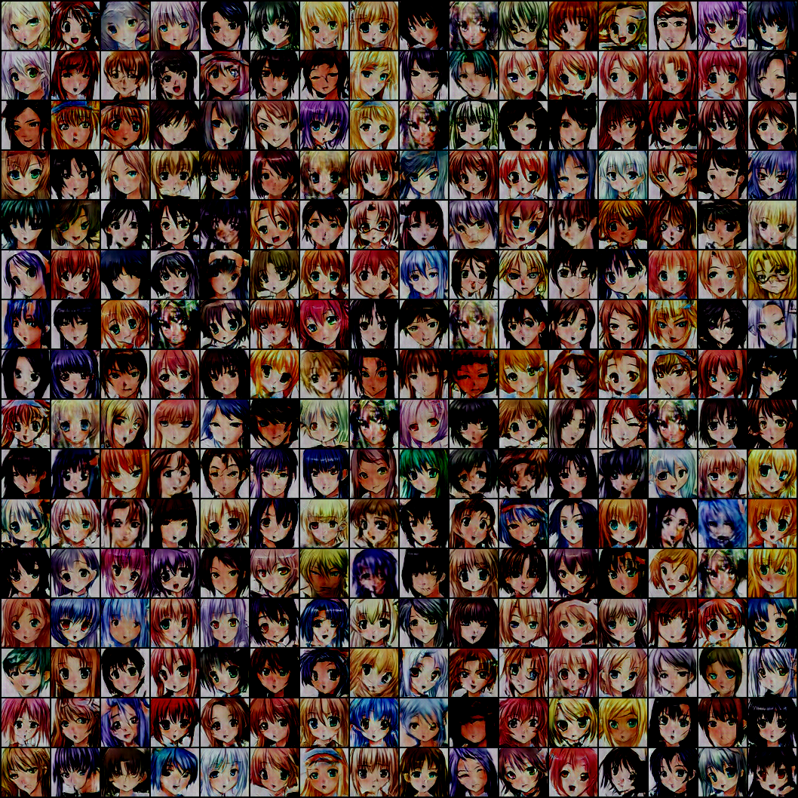

## Generative Adversarial Networks for Generating Anime face

#### 1. Introduction
- Here we will train a GAN to generate anime face 
- The dataset can be downloaded from [kaggle anime face dataset](https://www.kaggle.com/datasets/splcher/animefacedataset), download the dataset to `dataset` directory and put all the images under directory `anime/raw/images`, when you finish, the dataset looks like this:
```text
dataset
├── anime
│   └── raw
│   │   └── images
│   │       ├── 46651_2014.jpg
│   │       ├── 4665_2003.jpg
│   │       ├── ...
```
- Then we have to process these raw images, we've already done it, you can check this step following [VAE_ANIME](../VAE_ANIME), then your directory looks like this:
```text
dataset
├── anime
│   ├── processed
│   │   └── images
│   │       ├── 46651_2014.jpg
│   │       ├── 4665_2003.jpg
│   │       ├── ...
│   └── raw
│   │   └── images
│   │       ├── 46651_2014.jpg
│   │       ├── 4665_2003.jpg
│   │       ├── ...
```

#### 2. Load dataset, Build model, Train model
- After we finish all of the code(of course you can check the code carefully), let's begin training
- Here I just use a NVIDIA GeForce RTX 3090 to train, each epoch will cost about 30 seconds
- If you want to train from scratch, you don't have to modify any thing. If you finish training and want to generate anime picture, modify `mode`, simply run program and wait for your generated anime faces
```shell
python run.py
```
- Of course, you can modify the model architecture or try some other hyper parameters, do anything you want

#### 3. Check the quality of generated image
- I train the model for 200 epochs, you can train for more epochs and I guess the effect will be better
- First let's see the real anime faces



- Then we will use random Gaussian Noise to sample some images, here are 256 examples



- I think the quality is good cause the total parameters of our generator is only 6.3M. The architecture used here is not exactly the same as the original DCGAN which is larger, you can try that architecture
- Compare to [VAE](../VAE_ANIME), GAN produces sharper lines while VAE produces slightly blurred images, this is a advantage of GAN

#### 4. Some references
- [Generative Adversarial Nets](https://arxiv.org/pdf/1406.2661.pdf)
- [Unsupervised Representation Learning with Deep Convolutional Generative Adversarial Networks](https://arxiv.org/pdf/1511.06434.pdf)