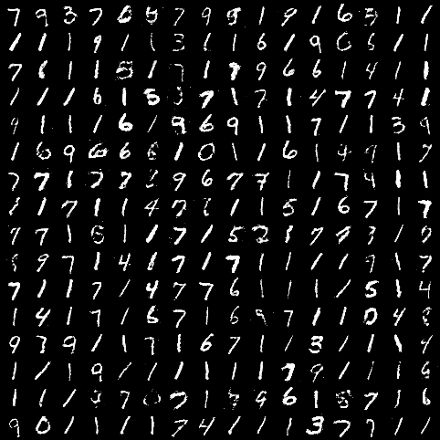

## Generative Adversarial Networks for Generating Handwriting Numbers

#### 1. Introduction
- Here we will train a GAN to generate handwriting number 
- The dataset is MNIST, it will be download under the folder `dataset` using torchvision, the dataset folder structure looks like this:
```text
dataset
├── mnist
│   └── MNIST
│   │   └── raw
│   │       ├── t10k-images-idx3-ubyte
│   │       ├── t10k-images-idx3-ubyte.gz
│   │       ├── t10k-labels-idx1-ubyte
│   │       ├── t10k-labels-idx1-ubyte.gz
│   │       ├── train-images-idx3-ubyte
│   │       ├── train-images-idx3-ubyte.gz
│   │       ├── train-labels-idx1-ubyte
│   │       └── train-labels-idx1-ubyte.gz
```

#### 2. Load dataset, Build model, Train model
- Make sure you have normalize the data, otherwise you'll find model doesn't converge, check `dataset.py`
- For this task, we just build a easy model which only contains fully connected layer, no convolutions
- Here I use a NVIDIA GeForce RTX 3090 to train, each epoch will cost about 7 seconds
- If you want to train from scratch, you don't have to modify any thing. If you finish training and want to generate number picture, modify `mode`, simply run program and wait for your generated numbers
```shell
python run.py
```
- Of course, you can modify the model architecture or try some other hyper parameters, do anything you want 

#### 3. Check the quality of generated image
- You can check the model generation effect using tensorboard, we save it every 20 epochs
- Here we will use random Gaussian Noise to sample some images, here are 256 examples



- I think the quality is good because we just use such a simple model, but the time cost is a little bit high

#### 4. Some references
- [Generative Adversarial Nets](https://arxiv.org/pdf/1406.2661.pdf)