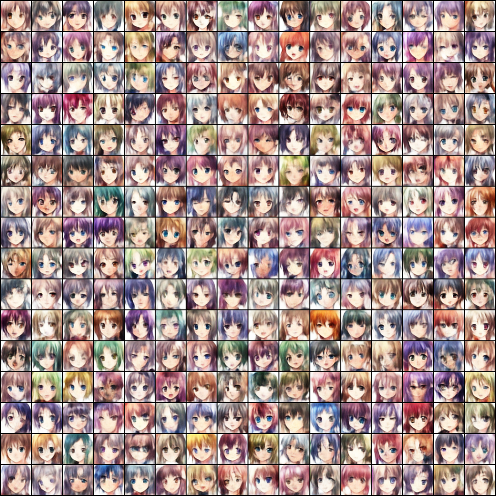
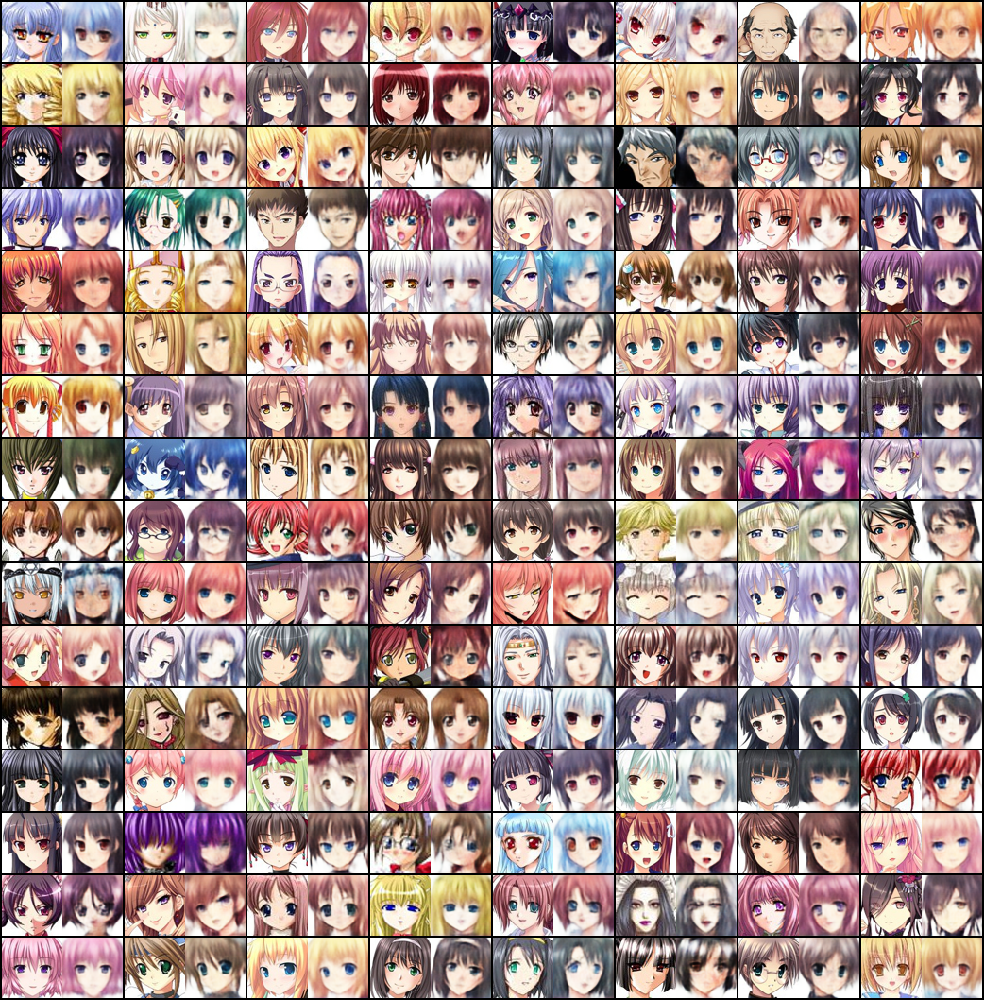

## Variational Auto Encoder for Generating Anime face

#### 1. Introduction
- Here we will train a VAE to generate anime face 
- The dataset can be downloaded from [kaggle anime face dataset](https://www.kaggle.com/datasets/splcher/animefacedataset), download the dataset to `dataset` directory and put all the images under directory `anime/raw/images`, when you finish, the dataset looks like this:
```text
dataset
├── anime
│   └── raw
│   │   └── images
│   │       ├── 46651_2014.jpg
│   │       ├── 4665_2003.jpg
│   │       ├── ...
```
- Then we have to process these raw images, simply execute command `python preprocess.py`, then your directory looks like this:
```text
dataset
├── anime
│   ├── processed
│   │   └── images
│   │       ├── 46651_2014.jpg
│   │       ├── 4665_2003.jpg
│   │       ├── ...
│   └── raw
│   │   └── images
│   │       ├── 46651_2014.jpg
│   │       ├── 4665_2003.jpg
│   │       ├── ...
```

#### 2. Load dataset, Build model, Train model
- After we finish all of the code(of course you can check the code carefully), let's begin training
- Here I just use a NVIDIA GeForce RTX 3090 to train, each epoch will cost about 11 seconds
- If you want to train from scratch, you don't have to modify anything. If you finish training and want to generate anime picture, modify `mode`, simply run program and wait for your generated anime faces
```shell
python run.py
```
- Of course, you can modify the model architecture or try some other hyper-parameters, do anything you want

#### 3. Check the quality of generated image
- First of all, we will use random Gaussian Noise to sample some images, here are 256 examples



- Then we can see the reconstruct anime faces



- I think the quality is ok but not that amazing, you can see if deepening the network works better

#### 4. Some references
- [Tutorial on Variational Autoencoders(English)](https://arxiv.org/pdf/1606.05908.pdf)
- [Tutorial on Variational Autoencoders(Chinese)](https://zhuanlan.zhihu.com/p/348498294)
- [During training, it's reasonable that reconstruct loss decrease, but why KL divergence increase](https://www.cnblogs.com/BlueBlueSea/p/13149464.html)