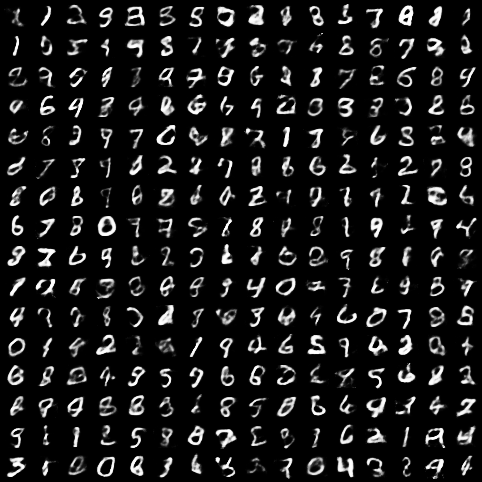
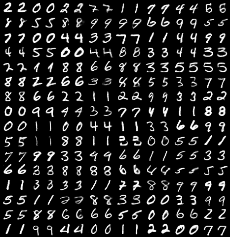

## Variational Auto Encoder for Generating Handwriting Numbers

#### 1. Introduction
- Here we will train a VAE to generate handwriting number 
- The dataset is MINIST, it will be download under the folder `dataset` using torchvision, the dataset folder structure looks like this:
```text
dataset
├── mnist
│   └── MNIST
│   │   └── raw
│   │       ├── t10k-images-idx3-ubyte
│   │       ├── t10k-images-idx3-ubyte.gz
│   │       ├── t10k-labels-idx1-ubyte
│   │       ├── t10k-labels-idx1-ubyte.gz
│   │       ├── train-images-idx3-ubyte
│   │       ├── train-images-idx3-ubyte.gz
│   │       ├── train-labels-idx1-ubyte
│   │       └── train-labels-idx1-ubyte.gz
```

#### 2. Load dataset, Build model, Train model
- For this task, we just build a easy model which only contains fully connected layer, no convolutions
- Here I use a NVIDIA GeForce RTX 3090 to train, each epoch will cost about 3 seconds
- If you want to train from scratch, you don't have to modify any thing. If you finish training and want to generate number picture, modify `mode`, simply run program and wait for your generated numbers
```shell
python run.py
```
- Of course, you can modify the model architecture or try some other hyper parameters, do anything you want

#### 3. Check the quality of generated image
- First of all, we will use random Gaussian Noise to sample some images, here are 256 examples



- Then we can see the reconstruct numbers



- I think the quality is good because we just use such a simple model, you can try the model we used in [VAE_ANIME](../VAE_ANIME)

#### 4. Some references
- [Tutorial on Variational Autoencoders(English)](https://arxiv.org/pdf/1606.05908.pdf)
- [Tutorial on Variational Autoencoders(Chinese)](https://zhuanlan.zhihu.com/p/348498294)
- [During training, it's reasonable that reconstruct loss decrease, but why KL divergence increase](https://www.cnblogs.com/BlueBlueSea/p/13149464.html)