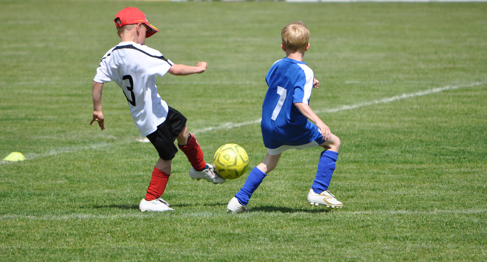
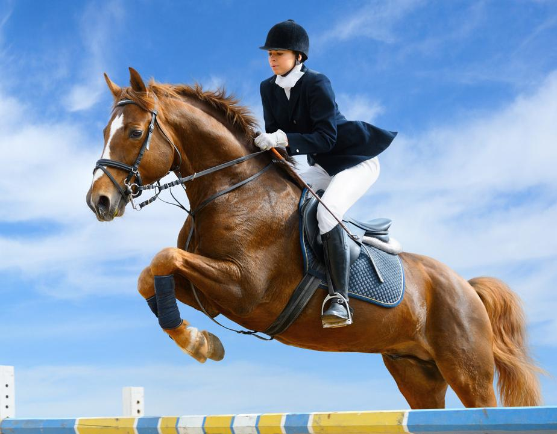

## Image Caption using VIT-GPT2

#### 1. Introduction
- Here we will train a seq2seq model to do image caption 
- The dataset is [Flickr 8k](https://www.kaggle.com/datasets/adityajn105/flickr8k?resource=download), it will be downloaded under the folder `dataset`, the dataset folder structure looks like this:
```text
dataset
└── flickr8k
    ├── Images
    └── captionx.txt
```

#### 2. Load dataset, Build model, Train model
- For this task, we build a seq2seq model to do image caption, we use vit-base for encoder and gpt2-medium for decoder
- Here I use a NVIDIA GeForce RTX 3090 to train, 5 epochs will cost about 3 hours
- If you want to train from scratch, you don't have to modify anything, just simply execute `sh train.sh`

#### 3. Check the quality of generated text
- After we pretrain the model for 5 epochs, we can execute `python inference.py` to generate text according to the image(note that you should modify the path to your own model and images)
- Then let's see two examples

```text
A boy in a blue uniform kicks a soccer ball while a boy in a white uniform watches.
```


```text
A woman is riding a horse in a show jumping contest.
```

#### 4. Some references
- [Show and Tell: A Neural Image Caption Generator](https://arxiv.org/abs/1411.4555)
- [Show, Attend and Tell: Neural Image Caption Generation with Visual Attention](https://arxiv.org/abs/1502.03044)